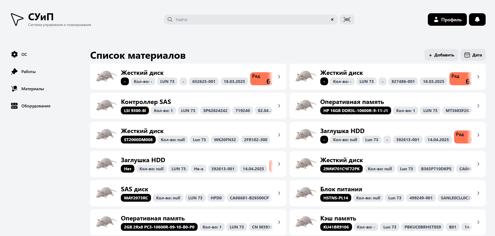

# Inventory Management System 🏭

**Веб-приложение для учета материалов на складе**  
[](https://reactjs.org/) 
[](https://www.typescriptlang.org/) 
[](https://flask.palletsprojects.com/) 
[](https://www.postgresql.org/) 
[](https://tailwindcss.com/)



Демо на Railway - https://suip-app-servers-passport-production.up.railway.app/ (закончилась пробная подписка)

## О проекте
Система инвентаризации материалов для оптимизации учета на складе. Реализовано:
- Управление материалами: добавление, редактирование, удаление.
- Поиск по названию, категориям, количеству.
- Заведение новых материалов в интерактивном формате.

## 🛠 Технологии
**Бэкенд**:
- Python 3.10+
- Flask 3.1.0
- PostgreSQL (psycopg2)

**Фронтенд**:
- React
- TypeScript
- TailwindCSS

## 🚀 Запуск локально
1. **Клонировать репозиторий**:
   ```bash
   git clone https://github.com/SBerestov/suip-app-servers-passport.git
   cd suip-app-servers-passport

2. **Настроить виртуальное окружение**
   ```bash
   python -m venv venv
   source venv/bin/activate  # Linux/Mac
   venv\Scripts\activate    # Windows

3. Установить зависимости
   ```bash
   pip install -r requirements.txt

4. Запустить приложение
   ```bash
   python run.app

5. В другом терминале перейти в frontend
    ```bash
    cd .\frontend\
    npm install
    npm run dev

6. Открыть приложение в браузере
    ```bash
    http://localhost:5173/

## 📸 Демонстрация работы
1. Гамбургер-меню и вывод записей из таблиц
   


2. Добавление нового материала
   


3. Форма дополнительной проверки после заведения данных
   


4. Просмотр данных записи
   


5. Редактирование текущей записи
    


6. Уадление записи
    


7. Поиск
    

